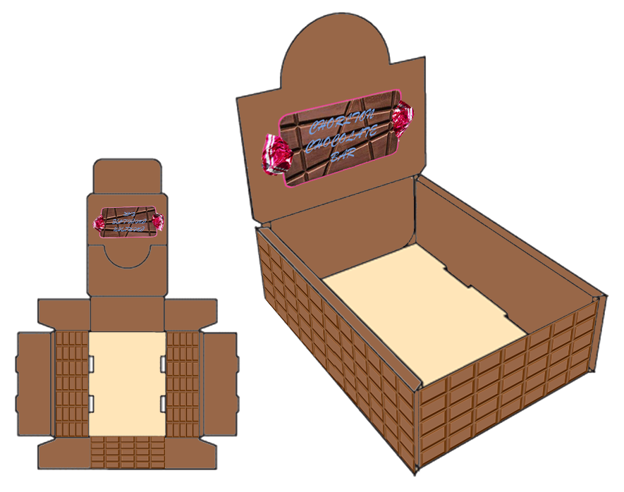

## Task 1



## Task 2

{% include module.html image_path="images/Unit-4-Task-2.png" title="Design 2 - Summer Festival Poster" description="I joined the SUMMER and FESTIVAL together, to give them a single gradient which I feel looks nice  I added a sun clip-art to go with the theme of summer.  The sun rays from the background image are also added to further emphasise the summer-ness of the festival.  I added some text to fill up space and inform the reader about the event, as well as that i added some placeholder text to show the coordinates of the place where the festival will take place.  I added fireworks as that’s what you do in summer right, so i had to put a radial gradient before them so the small particles aren’t as hard to see.  The bee represents Manchester and the background image is taken from a place in Manchester. this shows that the event will take place in Manchester." %}

## Task 3

{% include module.html image_path="images/Unit-4-Task-3-label.png" title="Design 3 - Can Label" description="I have got the appropriate dimensions for the label, I added some design on the edges to give it a more stylised look. At a point I wasn’t happy with the typography of the logo so I made it look more curly, which then contrasted with the sans-serif description title.  By this point I also added some description placeholder text, which looks like a lot. In the future I would make less text, and add more breaks between it.  I also added a green strawberry to go with the flavour’s name." %}



## Task 4

# Design 4 - Sales Box
I added a chocolate texture to the outside of the box to tell the customers what the product is about, and a picture of the chocolate on the board which gets the message out to the customer.  This design is simple and will be appealing to people who just want plain chocolate.  I chose this texture as it looks like an open piece of chocolate so the customers want to eat it, so instead they buy the chocolate.

## Task 5

{% include module.html image_path="images/Unit-4-Task-5.png" title="Design 5 - Ice-cream Van" description="I started by adding a giant ice cream cone to the top of the van, which has bright colours and a cute face to attract people.  I then added some more imagery and typography to the side of the van, which was one of photoshop default fonts, I added stroke and then skewed it to give it some more character.  I changed the door handles to be an ice-cream instead to give detail to the van.  The car’s colour palette is very simple which attracts people as it is not hard to look at, I used different soft tones of pink and burlap." %}

## Task 6

{% include module.html image_path="images/Unit-4-Task-6-Poster.png" title="Design 6 - Perfume Sales Poster" description="For the poster, I got a 3D Model of a perfume bottle that I had made before, and placed that in the middle. I then added the box behind it to show what it comes in. I added some text to make a message, which is relevant to the type of box it is. I also added some gold bullions to go with the “gold” theme.  Then at the end I added a seamless pattern in the background and a frame over that, which gave it a good look but the pattern was obstructing the product so I used a eraser brush rather than the more forward approach of selecting the borders of the product. this gave it a fade out effect which turned out to look rather good." %}

{% include module.html image_path="images/Unit-4-Task-6-Box.png" title="Design 6 - Perfume Net and Box" description="The box is black, it is a modified version of the template that I got from the resources, I painted it mostly black but i made the lid a metallic golden texture. which I feel makes the product feel more luxurious.  I then added some text to the back, which will be a description of the smell, the ingredients that are in the thing and a barcode.  I then added a flower next to the barcode and a decal of the perfume’s outline but filled with a solid colour at the front which gave the whole box some more fill. I would have added more texture to the sides of the box if I had to improve on this." %}

